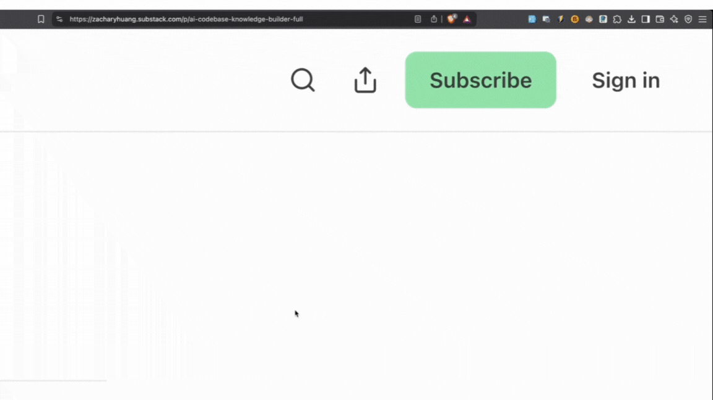

  
  
  # QuickCopy URL - Chrome Extension
  
  A simple Chrome extension that allows you to quickly copy the current page URL using a keyboard shortcut.

## Quick Demo

  

## Features

- Copy current page URL with a single keyboard shortcut
- Animated toast notification confirmation
- Cross-platform support (Mac and Windows)
- Minimal permissions required

## Keyboard Shortcuts

- **Mac**: `Cmd + Shift + L`
- **Windows/Linux**: `Ctrl + Shift + L`

## Installation

1. Clone or download this repository
2. Open Chrome and navigate to `chrome://extensions/`
3. Enable "Developer mode" in the top right corner
4. Click "Load unpacked" and select the extension directory
5. The extension should now be installed and ready to use

## Testing

1. Navigate to any webpage
2. Press the keyboard shortcut (`Cmd+Shift+L` on Mac or `Ctrl+Shift+L` on Windows)
3. The URL should be copied to your clipboard
4. A toast notification will appear confirming the action

## Permissions

The extension only requests the following permissions:
- `activeTab`: To access the current tab's URL
- `clipboardWrite`: To copy the URL to clipboard
- `scripting`: To inject the toast notification